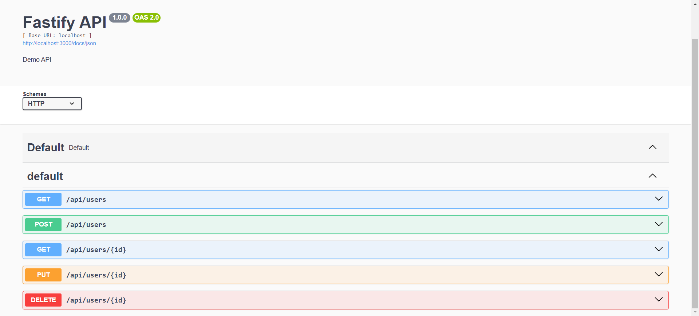

# Fastify API

## API Documentation

Visit: http://localhost:3000/docs



## Installation

Install node dependencies: 
```
npm install
```

Create `.env` file:
```
cp .env.example .env
```

Setup database in `.env` file. See example:
```
DB_USERNAME=root
DB_PASSWORD=root
DB_DATABASE=fastify_api
DB_HOST=localhost
DB_PORT=3306
```

Start application:
```
npm run start
```

Visit: http://localhost:3000

Note: 

For development run `npm run dev` command instead of `npm run start`.